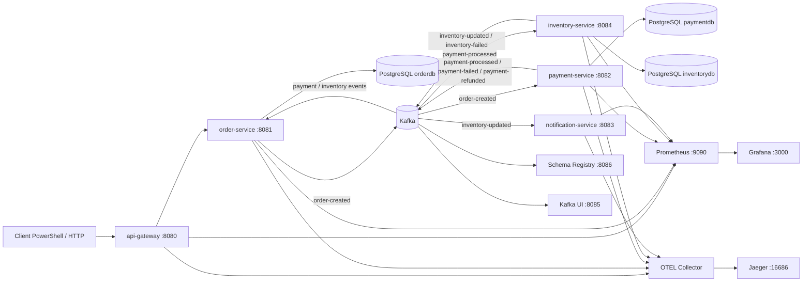

# Kafka Spring Microservices

[](https://github.com/bms1995/Kafka-springBoot/actions/workflows/ci.yml)


Projet local avec :
- `api-gateway`
- `order-service`
- `payment-service`
- `inventory-service`
- `notification-service`
- Kafka, Schema Registry, Kafka UI
- PostgreSQL separe pour order, payment et inventory
- Prometheus, Grafana, Actuator
- Saga, Outbox, Avro, Flyway, anti double paiement
- Resilience4j circuit breaker sur l'API Gateway

## Prerequis
- Java 21
- Maven 3.9+
- Docker Desktop

## Architecture
Le projet simule un systeme de commande e-commerce en microservices. L'API Gateway recoit les appels HTTP, puis les services communiquent principalement avec Kafka via des evenements Avro. Les bases PostgreSQL sont separees par domaine.



Responsabilites :
- `api-gateway` : point d'entree HTTP, routage, API key, correlation id, rate limiting
- `api-gateway` protege aussi les routes avec Resilience4j circuit breaker et fallback HTTP 503
- `order-service` : creation des commandes, read model, outbox, historique des evenements Saga
- `payment-service` : traitement paiement, idempotence anti double paiement, compensation remboursement
- `inventory-service` : reservation ou refus inventaire
- `notification-service` : consommation des evenements de commande confirmee
- `Kafka` : bus d'evenements entre services
- `Schema Registry` : contrats Avro des evenements Kafka
- `Prometheus` et `Grafana` : metriques et dashboards
- `OTEL Collector` et `Jaeger` : tracing distribue
- `PgAdmin` : inspection des bases PostgreSQL

Flux principal :
1. Le client cree une commande via `POST /api/orders`
2. `order-service` persiste la commande et publie `order-created`
3. `payment-service` consomme `order-created` et publie `payment-processed` ou `payment-failed`
4. `inventory-service` consomme `payment-processed` et publie `inventory-updated` ou `inventory-failed`
5. Si l'inventaire echoue, `payment-service` publie `payment-refunded`
6. `order-service` consomme les evenements et met a jour le statut final

## Lancer l'infra
```bash
docker compose up -d
```

Cette commande peut aussi lancer les 4 microservices si les jars ont ete packages avant le build Docker.

Build des jars puis demarrage complet :

```bash
cd order-service && mvn -DskipTests package && cd ..
cd payment-service && mvn -DskipTests package && cd ..
cd inventory-service && mvn -DskipTests package && cd ..
cd notification-service && mvn -DskipTests package && cd ..
docker compose up -d --build
```

URLs utiles :
- API Gateway : http://localhost:8080
- Kafka UI : http://localhost:8085
- Schema Registry : http://localhost:8086
- Prometheus : http://localhost:9090
- Grafana : http://localhost:3000
- PgAdmin : http://localhost:5050
- Kafka Exporter metrics : http://localhost:9308/metrics
- Jaeger tracing : http://localhost:16686

Grafana local :
- login : `admin`
- password : `admin`

## Manipulation rapide
Cette section donne le parcours le plus simple pour verifier le projet apres `docker compose up -d --build`.

1. Lancer le smoke test :

```powershell
.\scripts\smoke-test.ps1
```

Resultat attendu :

```text
Smoke test completed successfully.
```

2. Tester une commande depuis PowerShell :

```powershell
Invoke-RestMethod -Method Post `
  -Uri "http://localhost:8080/api/orders" `
  -Headers @{"X-API-Key"="local-dev-key"} `
  -ContentType "application/json" `
  -Body '{"orderId":"demo-order-1","productName":"MacBook Pro","quantity":1,"amount":250,"customerEmail":"client@test.com"}'
```

3. Lire l'etat de la commande :

```powershell
Invoke-RestMethod -Method Get `
  -Uri "http://localhost:8080/api/orders/demo-order-1" `
  -Headers @{"X-API-Key"="local-dev-key"}
```

4. Lire la timeline Kafka/Saga :

```powershell
Invoke-RestMethod -Method Get `
  -Uri "http://localhost:8080/api/orders/demo-order-1/events" `
  -Headers @{"X-API-Key"="local-dev-key"}
```

## Interfaces de controle
Kafka UI :
- URL : http://localhost:8085
- sert a voir les topics Kafka et les messages
- topics principaux : `order-created`, `payment-processed`, `inventory-updated`, `inventory-failed`, `payment-refunded`

Grafana :
- URL : http://localhost:3000
- login : `admin`
- password : `admin`
- menu : `Explore`
- datasource : `Prometheus`
- requetes utiles : `up`, `payment_succeeded_total`, `payment_failed_total`, `payment_refunded_total`, `order_outbox_published_total`

Jaeger :
- URL : http://localhost:16686
- champ `Service` : choisir `api-gateway`, `order-service`, `payment-service` ou `inventory-service`
- cliquer sur `Find Traces`
- sert a voir le chemin d'une requete entre les services

PgAdmin :
- URL : http://localhost:5050
- login : `admin@admin.com`
- password : `admin`
- ajouter les serveurs PostgreSQL manuellement

Serveur `order-db` :
- host : `postgres-order`
- port : `5432`
- database : `orderdb`
- username : `myuser`
- password : `mypassword`
- tables utiles : `orders`, `order_event_history`, `outbox_events`, `processed_events`

Serveur `payment-db` :
- host : `postgres-payment`
- port : `5432`
- database : `paymentdb`
- username : `myuser`
- password : `mypassword`

Serveur `inventory-db` :
- host : `postgres-inventory`
- port : `5432`
- database : `inventorydb`
- username : `myuser`
- password : `mypassword`

## Lancer les services
Lance les services dans 4 terminaux separes, dans cet ordre :

```bash
cd payment-service
mvn spring-boot:run
```

```bash
cd inventory-service
mvn spring-boot:run
```

```bash
cd notification-service
mvn spring-boot:run
```

```bash
cd order-service
mvn spring-boot:run
```

Gateway local :

```bash
cd api-gateway
mvn spring-boot:run
```

## Build Docker
Chaque microservice contient un Dockerfile Java 21. Construis le jar avant l'image :

```bash
cd api-gateway && mvn -DskipTests package && cd ..
docker build -t kafka-springboot/api-gateway:local ./api-gateway

cd order-service && mvn -DskipTests package && cd ..
docker build -t kafka-springboot/order-service:local ./order-service

cd payment-service && mvn -DskipTests package && cd ..
docker build -t kafka-springboot/payment-service:local ./payment-service

cd inventory-service && mvn -DskipTests package && cd ..
docker build -t kafka-springboot/inventory-service:local ./inventory-service

cd notification-service && mvn -DskipTests package && cd ..
docker build -t kafka-springboot/notification-service:local ./notification-service
```

La CI GitHub Actions verifie les tests Maven et le build des images Docker a chaque push/PR sur `main`.

## Tester avec PowerShell
Succes normal :

```powershell
Invoke-RestMethod -Method Post `
  -Uri "http://localhost:8080/api/orders" `
  -Headers @{"X-API-Key"="local-dev-key"} `
  -ContentType "application/json" `
  -Body '{"orderId":"order-123","productName":"MacBook Pro","quantity":1,"amount":250,"customerEmail":"client@test.com"}'
```

Echec paiement :

```powershell
Invoke-RestMethod -Method Post `
  -Uri "http://localhost:8080/api/orders" `
  -Headers @{"X-API-Key"="local-dev-key"} `
  -ContentType "application/json" `
  -Body '{"orderId":"order-fail-payment","productName":"MacBook Pro","quantity":1,"amount":999,"customerEmail":"client@test.com"}'
```

Echec inventory + compensation :

```powershell
Invoke-RestMethod -Method Post `
  -Uri "http://localhost:8080/api/orders" `
  -Headers @{"X-API-Key"="local-dev-key"} `
  -ContentType "application/json" `
  -Body '{"orderId":"fail-inventory-1","productName":"MacBook Pro","quantity":1,"amount":250,"customerEmail":"client@test.com"}'
```

Consulter l'etat materialise d'une commande :

```powershell
Invoke-RestMethod -Method Get `
  -Uri "http://localhost:8080/api/orders/order-123" `
  -Headers @{"X-API-Key"="local-dev-key"}
```

Consulter la timeline d'evenements d'une commande :

```powershell
Invoke-RestMethod -Method Get `
  -Uri "http://localhost:8080/api/orders/order-123/events" `
  -Headers @{"X-API-Key"="local-dev-key"}
```

## API Gateway
`api-gateway` est le point d'entree HTTP unique :
- port local : `8080`
- route `/api/orders/**` vers `order-service`
- route `/api/payments/**` vers `payment-service`
- route `/api/inventory/**` vers `inventory-service`
- route `/api/notifications/**` vers `notification-service`
- ajoute ou propage le header `X-Correlation-Id`
- protege les routes `/api/**` avec `X-API-Key`
- applique un rate limit par client, configurable via `API_GATEWAY_RATE_LIMIT_*`
- applique un circuit breaker Resilience4j par route avec fallback `503 Service Unavailable`
- expose `/actuator/prometheus`

API key locale par defaut :
- `API_GATEWAY_API_KEY_ENABLED=true`
- `API_GATEWAY_API_KEY_HEADER=X-API-Key`
- `API_GATEWAY_API_KEY=local-dev-key`

Rate limit local par defaut :
- `API_GATEWAY_RATE_LIMIT_ENABLED=true`
- `API_GATEWAY_RATE_LIMIT_REQUESTS=60`
- `API_GATEWAY_RATE_LIMIT_WINDOW=1m`

Smoke test complet :

```powershell
.\scripts\smoke-test.ps1
```

## Flux Saga
1. `order-service` persiste la commande et enqueue `order-created` dans son outbox
2. `payment-service` consomme `order-created`
3. Si paiement OK, `payment-service` publie `payment-processed`
4. `inventory-service` consomme `payment-processed`
5. Si inventory OK, `inventory-service` publie `inventory-updated`
6. `order-service` consomme les evenements payment/inventory et met a jour son read model
7. `notification-service` consomme `inventory-updated`

Compensations :
- paiement refuse : `payment-failed`
- inventory indisponible : `inventory-failed`
- compensation paiement : `payment-refunded`

Statuts de commande materialises par `order-service` :
- `CREATED`
- `PAYMENT_CONFIRMED`
- `PAYMENT_FAILED`
- `INVENTORY_CONFIRMED`
- `INVENTORY_FAILED`
- `REFUNDED`

## Inbox et Audit Trail
`order-service` garde une trace des evenements de saga recus :
- table `processed_events` pour ignorer les doublons Kafka
- table `order_event_history` pour reconstruire la timeline metier
- id d'evenement derive de `topic-partition-offset`
- endpoint `GET /api/orders/{orderId}/events`

Cette approche simule un pattern inbox/read-model utilise en production pour debug, replay controle et audit.

## Anti Double Paiement
`payment-service` combine :
- `orderId` comme idempotency key
- table `payment_transactions` avec `order_id` unique
- table `processed_events`
- transaction Spring
- transactional outbox dans `outbox_events`
- producer Kafka idempotent
- compteur `payment_duplicate_skipped_total`

## Transactional Outbox
`order-service` et `payment-service` utilisent une table `outbox_events` :
- l'etat metier et l'evenement sont ecrits dans la meme transaction DB
- un publisher planifie publie les evenements pending vers Kafka
- si Kafka est indisponible, l'evenement reste en base et sera rejoue
- les publishers exposent des compteurs Prometheus de succes/echec

## Avro et Schema Registry
Les evenements Kafka utilisent Avro :
- schemas dans `src/main/avro`
- classes Java generees par `avro-maven-plugin`
- `KafkaAvroSerializer`
- `KafkaAvroDeserializer`
- namespace partage : `com.example.events`
- Schema Registry : `SCHEMA_REGISTRY_URL`

Documentation des contrats :
- catalogue humain : `docs/event-catalog.md`
- specification AsyncAPI : `docs/asyncapi.yaml`
- roadmap production : `docs/production-readiness.md`

## Event Metadata
Les evenements de saga portent des metadonnees de tracing :
- `eventId` : identifiant unique de l'evenement
- `correlationId` : identifiant stable de la saga complete
- `causationId` : evenement parent qui a cause le nouvel evenement
- `occurredAt` : horodatage de production
- `producer` : service producteur
- `schemaVersion` : version logique du contrat

Exemple de chaine :
`order-created.eventId` devient le `causationId` de `payment-processed`, tout en gardant le meme `correlationId`.

## Observabilite
Health :
- api-gateway : http://localhost:8080/actuator/health
- order-service : http://localhost:8081/actuator/health
- payment-service : http://localhost:8082/actuator/health
- notification-service : http://localhost:8083/actuator/health
- inventory-service : http://localhost:8084/actuator/health

Metrics :
- `/actuator/prometheus` sur chaque service
- metriques payment/outbox :
  - `order_outbox_published_total`
  - `order_outbox_publish_failed_total`
  - `payment_succeeded_total`
  - `payment_failed_total`
  - `payment_duplicate_skipped_total`
  - `payment_refunded_total`
  - `payment_outbox_published_total`
  - `payment_outbox_publish_failed_total`

Alertes Prometheus :
- `monitoring/alerts.yml`
- service down
- Kafka exporter down
- Kafka consumer lag high
- outbox publish failures
- payment failures spike

Tracing distribue :
- les services exportent les traces en OTLP HTTP vers `OTEL_TRACING_ENDPOINT`
- Docker Compose configure `OTEL_TRACING_ENDPOINT=http://otel-collector:4318/v1/traces`
- `otel-collector` exporte ensuite vers Jaeger
- UI Jaeger : http://localhost:16686

## Resilience Kafka
Les consommateurs critiques utilisent un `DefaultErrorHandler` Spring Kafka :
- 3 tentatives de retry
- pause de 2 secondes entre les tentatives
- publication du message en echec vers un topic dead-letter `nom-du-topic.DLQ`
- logs de chaque tentative avec topic, cle et payload

Services couverts :
- `order-service`
- `payment-service`
- `inventory-service`
- `notification-service`

## Migrations DB
Flyway gere les schemas :
- `order-service/src/main/resources/db/migration/V1__init_order_schema.sql`
- `order-service/src/main/resources/db/migration/V2__add_order_read_model_columns.sql`
- `order-service/src/main/resources/db/migration/V3__add_order_inbox_and_event_history.sql`
- `payment-service/src/main/resources/db/migration/V1__init_payment_schema.sql`
- `inventory-service/src/main/resources/db/migration/V1__init_inventory_schema.sql`

Hibernate est en `ddl-auto: validate`.

## Tests
```bash
cd payment-service
mvn test
```

```bash
cd inventory-service
mvn test
```

Le test Testcontainers de `payment-service` utilise PostgreSQL reel quand Docker est accessible. Sinon il est ignore automatiquement.

## Reset Local
Supprime les donnees locales Docker :

```bash
docker compose down -v
docker compose up -d
```

Attention : cette commande supprime les volumes PostgreSQL locaux.
